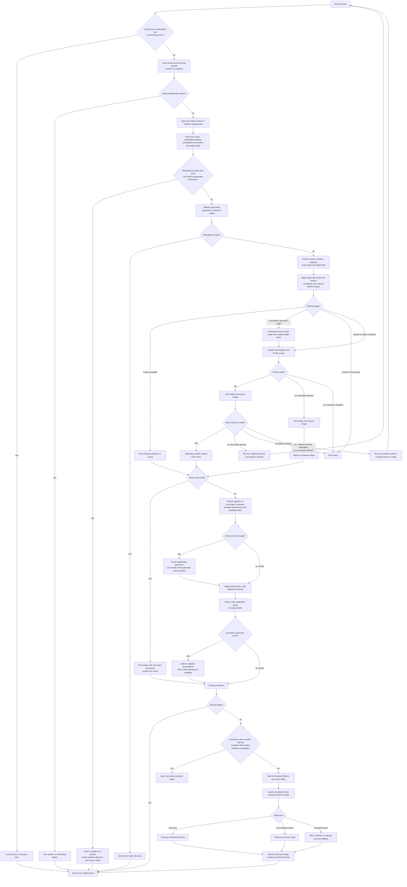
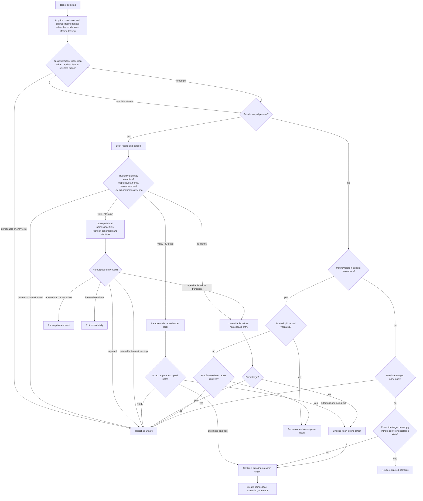
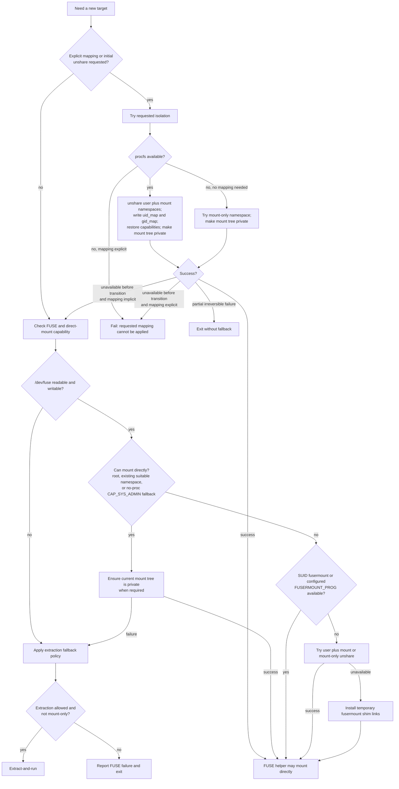
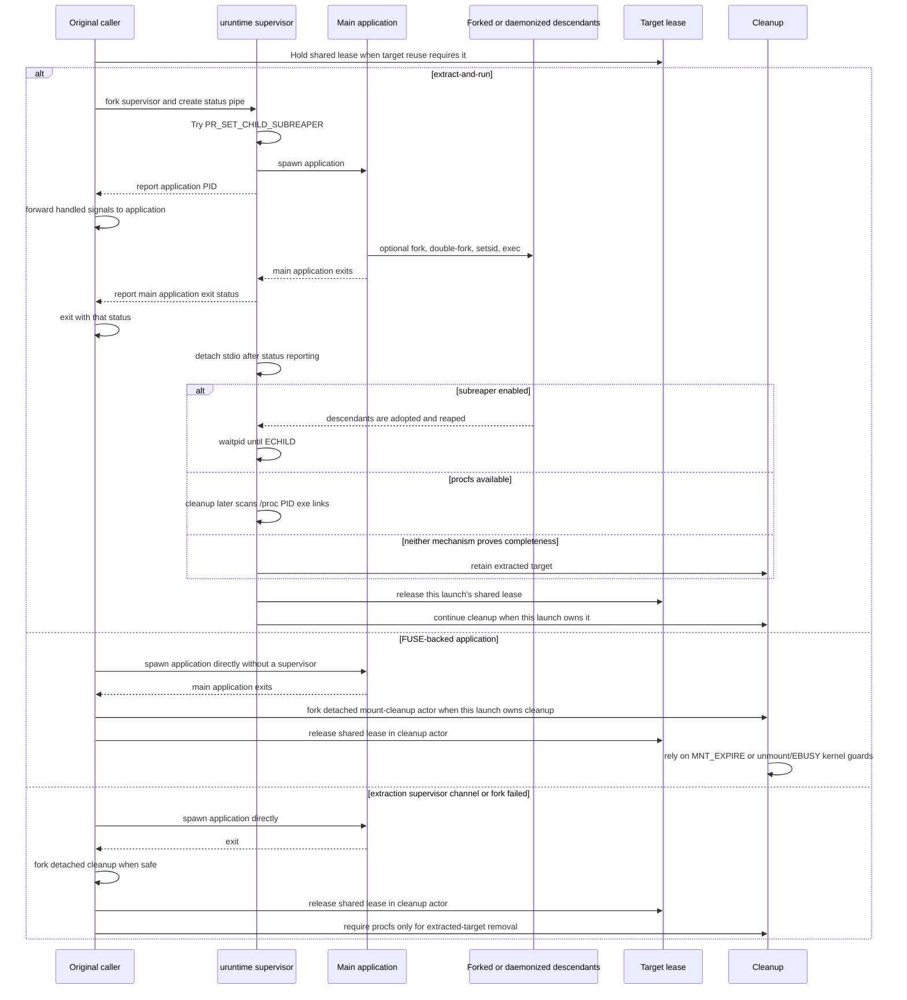
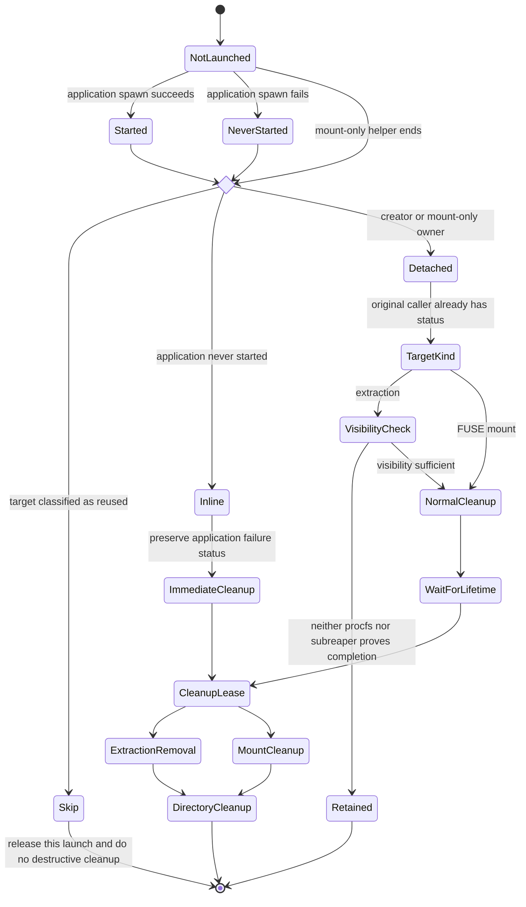
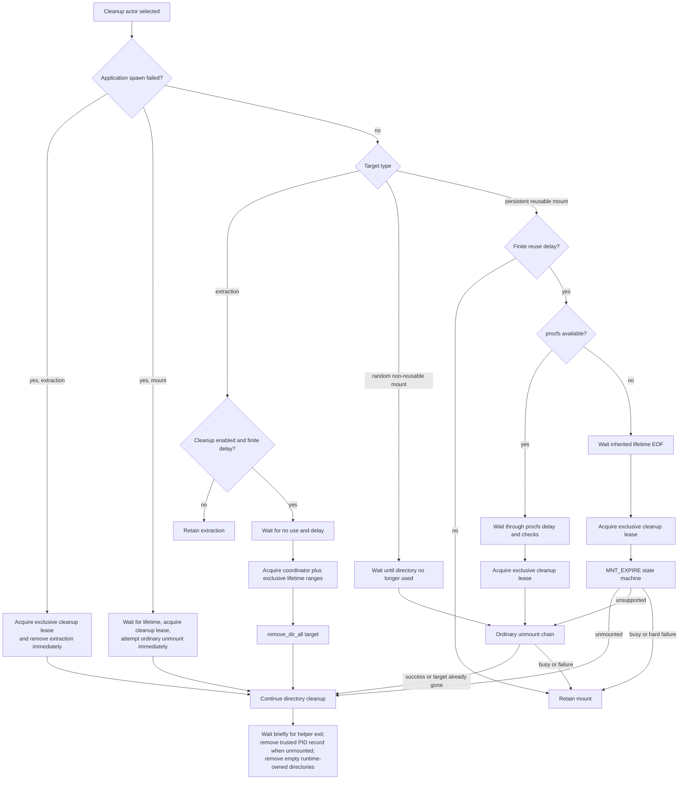

# Application Launch, Lifetime, and Cleanup

This document describes the complete runtime lifecycle implemented by `uruntime`: entry dispatch, executable and image selection, launch-mode resolution, namespace and FUSE fallbacks, target reuse, application supervision, exit-status propagation, and cleanup.

It applies to both AppImage and RunImage builds. Where names differ:

- AppImage uses `APPIMAGE_*`, `AppRun`, `APPDIR`, and `APPIMAGE`;
- RunImage uses `RUNIMAGE_*`, `Run.sh` through `static/bash`, `RUNDIR`, and `RUNIMAGE`;
- both accept the universal `--uruntime-*` CLI prefix in addition to `--appimage-*` or `--runtime-*`.

The implementation in [`src/main.rs`](../src/main.rs) is authoritative. This document explains the policy and the resulting state transitions rather than replacing the code.

## 1. Lifecycle overview



The important separation is:

1. **target preparation** decides whether a pathname may be created or reused;
2. **application lifetime observation** decides when the application tree is finished;
3. **the target lease** coordinates every uruntime launch sharing the target;
4. **mount expiry or unmount** remains a separate kernel-level safety step.

No single PID, pathname hash, inherited file descriptor, or process-parent relationship is treated as sufficient for every part of the lifecycle.

## 2. Core invariants

The runtime follows these invariants throughout startup and cleanup:

1. The runtime executable and appended image are opened and retained by file descriptor. Helpers and self-reexecution continue using the opened inode even if the original pathname is renamed, removed, or replaced.
2. A deterministic target hash is a cache key, not proof of process, mount, or namespace ownership.
3. Explicit UID/GID mapping intent is security-significant even when the requested IDs equal the current IDs.
4. A private namespace may be reused only after validating mapping, process generation, namespace kind, and concrete namespace identities.
5. A namespace transition that has already changed the caller is never followed by a fresh-target fallback.
6. A fixed target is never silently replaced with another path. Automatic targets may use a fresh sibling only while the caller is still in its original namespace.
7. Every participating launch of a reusable extraction or persistent FUSE target holds a shared lifetime lease. Destructive cleanup requires the coordinator and an exclusive lease.
8. If uruntime cannot prove that daemonized descendants are finished, it retains an extracted target rather than deleting it unsafely. FUSE cleanup relies on kernel unmount and expiry safeguards instead.
9. A failed application spawn is represented separately from a normally exited application and receives immediate inline cleanup while preserving the launch failure status.
10. Busy mounts and hard expiry failures are retained. Cleanup must fail safe.

### 2.1 Internal state model

The implementation uses typed state transitions rather than overloaded booleans. The exact Rust variants and their lifecycle meanings are:

| Type | Variants | Meaning |
|---|---|---|
| `NamespaceKind` | `Current`, `MountOnly`, `UserAndMount` | where the FUSE mount exists and whether a user namespace mapping is active |
| `TryUnshareResult` | `Created`, `Unavailable`, `IrreversibleFailure` | whether isolation was created, failed before transition, or failed after an irreversible transition |
| `NamespaceEntryResult` | `Entered`, `Unavailable`, `Rejected`, `IrreversibleFailure` | authenticated `setns` result and whether fallback remains legal |
| `TryReuseResult` | `Reused`, `StaleRemoved`, `Unavailable`, `Rejected`, `IrreversibleFailure` | private mount reuse outcome |
| `ExistingTargetAction` | `Reuse`, `Create`, `Reject` | final generic decision for an existing target |
| `ApplicationState` | `NotLaunched`, `Started`, `NeverStarted` | whether application launch was attempted and whether spawn succeeded |
| `CleanupExecution` | `Skip`, `Detached`, `Inline` | cleanup ownership and whether application status must be preserved by the cleanup process |
| `CleanupWork` | `ImmediateMount`, `ImmediateExtraction`, `Normal` | failed-spawn cleanup versus the normal delayed path |
| `ExpireMountResult` | `Unmounted`, `Marked`, `Busy`, `Unsupported`, `Failed` | result of one `MNT_EXPIRE` syscall |
| `ExpireMountOutcome` | `Unmounted`, `Retained`, `FallbackUnmount` | terminal expiry policy decision |

`Unavailable` permits fallback only while no irreversible namespace change has occurred. `Rejected` means that available state was inspected but failed policy or identity checks. `IrreversibleFailure` always terminates the current flow.

## 3. Entry dispatch and early exits

Before opening an appended image, `uruntime` checks invocation mode.

### 3.1 Invocation by executable name

A hard link, symbolic link, or renamed copy with one of these basenames directly executes the matching embedded helper when that helper is compiled into the selected variant:

- `squashfuse`, `unsquashfs`, `sqfscat`, `mksquashfs`, `sqfstar`;
- `dwarfs`, `dwarfsck`, `mkdwarfs`, `dwarfsextract`.

The helper is decompressed and executed through `memfd-exec`; when that mechanism cannot provide an executable path, the pinned helper library can use its temporary-file compatibility path. `NO_MEMFDEXEC=1` explicitly selects the temporary-file path.

When invoked as `fusermount` or `fusermount3`, uruntime:

1. detects an unmount request and handles it through its unmount chain; or
2. removes uruntime's temporary fusermount directory from `PATH` and executes the real command, preventing recursive shim invocation.

These paths do not enter the application lifecycle.

### 3.2 CLI parsing before image discovery

Unshare options are removed from application arguments until `--` is encountered. Both the format-specific prefix and `--uruntime-unshare*` are accepted. Missing or nonnumeric UID/GID values produce exit status `2`.

The following operations can run before an appended filesystem is required:

- `--*-version`;
- direct invocation of compiled-in filesystem helpers.

After the runtime ELF prefix has been parsed, these additional operations also exit before application launch:

- help;
- portable-directory creation;
- image offset;
- signature, update information, and embedded environment reads or writes.

`TARGET_APPIMAGE` or `TARGET_RUNIMAGE` can redirect maintenance operations to another image. The target is opened first and retained by descriptor.

### 3.3 Standalone extraction

`--*-extract [PATTERN]` validates the appended image, extracts into `AppDir` or `RunDir` under the current directory, and exits. AppImage extraction also maintains the `squashfs-root` link. This is a maintenance operation, not extract-and-run, so the application supervisor and normal target cleanup protocol are not entered.

## 4. Retained executable and image identity

### 4.1 Finding the executable

The runtime tries these sources in order:

1. open `/proc/self/exe` while resolving the display path separately;
2. `current_exe()`;
3. `AT_EXECFN` from the ELF auxiliary vector;
4. a path derived from `argv[0]`, including `PATH` lookup for a bare command name.

The opened file's device, inode, and size are retained. ELF parsing reads only the bounded runtime prefix needed for headers and custom sections; the appended filesystem remains in the same open file.

### 4.2 Helper access to the image

A mount or extraction helper prefers a verified `/proc/self/fd/N` or `/dev/fd/N` path to the retained image descriptor. The descriptor's `FD_CLOEXEC` bit is cleared only for the helper exec path. If descriptor paths are unavailable, uruntime reopens the original pathname and accepts it only when `dev` and `ino` still match the retained inode.

### 4.3 Self-reexecution fallback

Fallback from a failed mount reexecutes the retained runtime using:

1. `execveat(fd, "", ..., AT_EMPTY_PATH)`;
2. for compatibility errors `ENOSYS`, `ENOTSUP`, compatible `EINVAL`, or `EPERM`, a verified `/proc/self/fd/N` or `/dev/fd/N` path;
3. as a final compatibility fallback, the original pathname after exact `dev`/`ino` verification.

An unrelated replacement at the original pathname is never intentionally executed.

## 5. Configuration and mode resolution

The embedded strings in the runtime are evaluated together with CLI and environment requests.

### 5.1 Extraction policy

| `URUNTIME_EXTRACT` | Startup policy |
|---|---|
| `0` | FUSE only; automatic extraction fallback is forbidden. |
| `1` | Always use extract-and-run. |
| `2` | Try FUSE, then extract regardless of image size. |
| `3` | Try FUSE, then extract only when the complete executable is at most 350 MiB. |

`--*-extract-and-run` and `<ENV>_EXTRACT_AND_RUN=1` force extract-and-run. `--*-mount` is mount-only and never falls back to extraction.

### 5.2 Mount reuse and delay policy

| `URUNTIME_MOUNT` | FUSE target | Default delay |
|---|---|---|
| `0` | stable reusable target | infinite for FUSE; 5 seconds for extract-and-run |
| `1` | random non-reusable FUSE target | no configured default; an empty parsed delay becomes the one-second compatibility default |
| `2` | stable reusable target | 30 minutes |
| `3` | stable reusable target | 5 seconds |
| other | random non-reusable FUSE target | one-second compatibility default when cleanup parses an empty delay |

`REUSE_CHECK_DELAY` overrides the selected default. Accepted forms are an integer number of seconds, `Ns`, `Nm`, `Nh`, `0`, or `inf`. Invalid values use one second. Arithmetic overflow also falls back to one second.

When a reusable mode supplied a default:

- `REUSE_CHECK_DELAY=0` disables persistent FUSE reuse and leaves a zero cleanup delay;
- `REUSE_CHECK_DELAY=inf` disables timed cleanup.

`NO_UNMOUNT=1` changes the current FUSE run to an infinite reusable lifetime after target preparation. If the original configuration selected a random target, it stays random and no cross-launch lease is retroactively added.

### 5.3 Extraction cleanup policy

Extraction cleanup is enabled only when embedded `URUNTIME_CLEANUP=1` and `NO_CLEANUP` is not `1`. A finite parsed reuse delay is also required. `inf`, `NO_CLEANUP=1`, or an embedded cleanup value other than `1` retains the extraction.

### 5.4 Namespace and capability policy

Isolation can be requested by:

- embedded `URUNTIME_UNSHARE`;
- `--*-unshare*` CLI options;
- `<ENV>_UNSHARE`, `<ENV>_UNSHARE_ROOT`, `<ENV>_UNSHARE_UID`, or `<ENV>_UNSHARE_GID`.

Root mapping takes precedence over separate UID/GID values. Any explicit mapping enables unshare. Explicit intent remains explicit even when the values equal the current IDs.

| Mode | Namespace request | Application capability policy |
|---|---|---|
| `0` | no initial request | keep capabilities unless another option changes policy |
| `1` | request namespace isolation | keep capabilities |
| `2` | request namespace isolation | drop ambient, bounding, effective, permitted, and inheritable capabilities before application exec |
| `3` | no initial request | drop capabilities only when isolation/direct privileged mounting is entered as an automatic fallback |

Capabilities are dropped only in the application child's pre-exec hook and only after successful isolation or the privileged no-proc direct-mount fallback. Filesystem helpers keep the capabilities needed to mount.

## 6. Target naming and coordination files

### 6.1 Automatic targets

Automatic extraction and persistent FUSE targets use a stable hash derived from:

- runtime ELF-header bytes;
- sampled appended-image content;
- current UID;
- requested UID/GID values and explicit-mapping intent when mapping was explicitly requested.

AppImage names are under `TMPDIR`:

- extraction: `appimage_extracted_<name><hash>`;
- persistent mount: `.mount_<name>remp<hash>`;
- nonpersistent mount: `.mount_<name><random>`.

RunImage names are under `TMPDIR/.r<uid>/mnt`:

- extraction: `<name>extr<hash>`;
- persistent mount: `<name>remp<hash>`;
- nonpersistent mount: `<name><random>`.

### 6.2 Fixed targets

`APPIMAGE_TARGET_DIR` or `RUNIMAGE_TARGET_DIR` selects an exact path. The variable is removed before launching the application so it does not recursively affect child execution.

A fixed target cannot be replaced by an automatic fresh path. Unsafe or unverifiable existing state therefore causes a fail-closed exit.

### 6.3 Records and lock inode

Depending on mode, uruntime uses these adjacent files:

- `target.with_extension("pid")`: trusted current-namespace mount owner record;
- `target.with_extension("un.pid")`: trusted private-namespace mount owner record;
- the complete target pathname plus `.lock`: the protected coordination inode for preparation, lifetime, cleanup, record publication, validation, and stale-record removal.

`Path::with_extension` replaces a target's final extension; `.lock` is instead appended to the complete target name. Automatic and fresh target names are selected so PID-record derivation cannot alias another target's records.

The lock inode is opened once on the normal preparation path with `O_NOFOLLOW | O_CLOEXEC`, created as mode `0600`, and accepted only when it is a regular file owned by the current UID with no group/other permission bits. Its `dev` and `ino` identity is captured from the opened descriptor. After every potentially blocking final range acquisition, uruntime revalidates the opened descriptor and pathname for regular-file type, owner, private mode, and unchanged `dev`/`ino`, rejecting replacement or permission changes that occur while waiting.

Linux open-file-description locks divide that inode into independent one-byte ranges:

| Byte range | Lock mode | Purpose |
|---:|---|---|
| `0` | exclusive | target preparation and destructive cleanup coordinator |
| `1` | shared for applications; exclusive for cleanup | target lifetime lease |
| `2` | exclusive | PID-record publication, validation, and stale-record removal |

Cloned descriptors share one open-file description. Preparation, record-publication, and cleanup guards therefore explicitly unlock their own ranges when dropped, so those ranges do not wait for the inherited lifetime descriptor to close. The shared lifetime guard is deliberately different: dropping the runtime's copy only closes that descriptor and does not issue `F_UNLCK`, leaving the shared range held until the last application or descendant copy of the same open-file description closes. Only the lifetime descriptor has `FD_CLOEXEC` cleared in the application child's pre-exec hook.

The lock inode intentionally remains after target removal. Removing its pathname while another process still holds or opens it could split coordination across two inodes. It follows the containing temporary directory's lifecycle.

Kernels before Linux 3.15 and filesystems without OFD-lock support use the conservative `flock` backend. That compatibility path keeps the former separate `<target>.lease`, `<target>.lease.lock`, and `<record>.lock` files because `flock` cannot express independent byte ranges. Permission failures such as `EPERM` or `EACCES` fail closed instead of selecting another backend: otherwise differently sandboxed peers could split coordination between independent OFD and `flock` lock domains. This fallback preserves lifecycle semantics; it is not a migration protocol for concurrently running pre-release runtime revisions.

### 6.4 Lifetime lease coverage

A shared lifetime lease is acquired for:

- every extract-and-run target;
- every persistent reusable FUSE target.

It is not acquired for an ordinary random non-reusable FUSE target. The preparation coordinator range is held while existing state is inspected and while a create/reuse decision is made, then explicitly unlocked before application execution. The shared lifetime range remains held.

If an automatic mount must move to a fresh sibling, the old shared lease and coordinator are released and reacquired for the new pathname.

## 7. Existing target and reuse decisions



### 7.1 Trusted mount records

A trusted version-2 record contains:

- helper PID;
- namespace kind: `current`, `mnt`, or `user,mnt`;
- effective UID and GID mapping;
- `/proc/<pid>/stat` process start time;
- user and mount namespace device/inode identities.

Known fields must be complete, well-formed, and unique. Legacy records remain parseable but are not trusted for namespace reuse.

Records are published atomically:

1. acquire the exclusive record-publication range on the target lock inode;
2. remove only bounded, correctly named orphan temporary entries;
3. create a same-directory `0600` temporary file with `O_EXCL` semantics;
4. write and `sync_all`;
5. rename over the record.

A failed publication removes its temporary file. Orphan temporary entries left by a process crash are scavenged only while a record is being published. The hot record-validation/reuse path neither scans nor mutates the parent directory; temporary publication files do not participate in record parsing or trust decisions.

A record-write failure warns and affects future reuse, but does not retroactively invalidate a mount that is already running. On the intentional procfs-free current-namespace reuse path, no unverifiable PID record is written.

### 7.2 Private namespace reuse

A `.un.pid` candidate is processed before generic mount detection. uruntime requires exact mapping and process-generation identity before calling `setns`.

The runtime pins the target user and mount namespace files, verifies their identities twice around process-generation checks, compares the recorded namespace kind with the actual namespace difference, and enters only the required namespaces.

Results are handled as follows:

| Result | Automatic target | Fixed target |
|---|---|---|
| validated entry and expected mount exists | reuse | reuse |
| stale dead owner and free target | continue on same path | reject |
| unavailable before transition | select a fresh sibling | reject |
| identity mismatch or malformed state | reject | reject |
| irreversible partial transition | exit immediately | exit immediately |
| namespace entered but expected mount absent | reject; no fresh fallback | reject |

Fresh names append `fresh<random>` to the complete filename rather than creating another extension, keeping `.pid` and `.un.pid` sidecars distinct from the original target.

### 7.3 Current-namespace reuse with procfs

A reusable mount visible in the current namespace normally requires a validated `.pid` record. The record must identify `NamespaceKind::Current`, match the requested mapping and process generation, and match the opened namespace identities.

An unmounted but nonempty persistent target is rejected. Contents alone do not prove that the expected FUSE mount exists.

### 7.4 Procfs-free direct FUSE reuse

A FUSE mount already visible in the current namespace may be reused without procfs only when all of these conditions hold:

- persistent reuse was selected;
- the target is the automatic hash-derived target, not a fixed path;
- no explicit UID/GID mapping was requested;
- procfs is unavailable;
- neither `.pid` nor `.un.pid` exists;
- the target is confirmed to be a live, readable mount.

This path does not call `setns` and does not write a PID record.

### 7.5 Extraction reuse

Extracted contents do not require a live helper or namespace transition, so their cache identity is hash-based. Nonempty matching targets can be reused. The shared lease prevents an earlier launch from deleting the directory while another launch still uses it.

A launch classified as `Reuse` does not start another cleanup actor. A launch classified as `Create` owns cleanup even when the extraction helper discovers that another process populated the hash target first and therefore performs no extraction. The exclusive lease still serializes those cleanup actors, so one cannot delete data while another shared user remains.

## 8. Namespace creation and FUSE availability



### 8.1 Unshare planning

| procfs | explicit/different mapping needed | Plan |
|---|---|---|
| available | either | create user and mount namespaces, configure maps |
| absent | no | create a mount-only namespace |
| absent | yes | impossible; fail closed |

If creating the combined user+mount namespace fails before any transition and no mapping was explicitly requested, uruntime may try mount-only isolation. If the user namespace was already created but mapping setup fails, the transition is irreversible and uruntime exits.

After creating or entering a mount namespace, failure to make the mount tree private is also irreversible and terminates the run.

### 8.2 Direct mounting

A direct helper mount is available when one of these is true:

- the caller is UID 0;
- uruntime successfully created or entered a suitable namespace;
- the caller is already in a user+mount namespace;
- procfs is absent and the caller has effective `CAP_SYS_ADMIN`.

The no-proc `CAP_SYS_ADMIN` case is a fallback in the current namespace and requires successfully making the mount tree private. Mount-only mode cannot use that current-namespace fallback because the path must remain exportable through a private mount owner.

### 8.3 Procfs-free private mounts

If procfs is absent and a private namespace is requested or required, persistent FUSE reuse is disabled before target generation. The launch uses a random non-reusable target because a private mount owner cannot later be authenticated safely without process-generation and namespace identity data.

Extraction remains hash-reusable because it does not require namespace-owner authentication.

### 8.4 FUSE-to-extraction and reexecution fallbacks

There are two distinct failure stages:

1. **FUSE is unavailable before helper startup**: apply `URUNTIME_EXTRACT` immediately. Mount-only never extracts.
2. **The helper was started but no mount appeared within one second**:
   - if this was the first ordinary attempt, set the format's `*_UNSHARE` request and reexec the retained runtime;
   - if isolation was already requested/attempted, and extraction policy allows it, remove stale isolation mapping variables as appropriate, set `*_EXTRACT_AND_RUN=1`, and reexec the retained runtime;
   - otherwise exit with the FUSE diagnostic.

Reexecution preserves the original argument list and uses the retained executable inode.

## 9. Creating the filesystem view

### 9.1 Helper process

For a new target, uruntime forks a helper child. The child:

1. starts a new session;
2. restores capabilities when it is inside a newly created namespace;
3. creates runtime-owned directories with mode `0700`;
4. redirects helper stdout to stderr;
5. executes the selected mount or extraction helper.

The parent waits synchronously for extraction. For mounting, it polls for a live mount for up to one second while also checking whether the helper exited.

### 9.2 SquashFS

- mounting uses embedded `squashfuse` with read-only, `nodev`, UID/GID, and image-offset options;
- extraction uses embedded `unsquashfs` with the image offset and optional pattern.

### 9.3 DwarFS

- mounting uses embedded `dwarfs` with read-only, `nodev`, UID/GID, image offset, cache, worker, block-size, readahead, preload, allocator, and optional analysis/debug settings;
- extraction uses `dwarfsextract` with image offset, cache, worker count, output path, and optional pattern.

Cache and worker defaults adapt to available memory and CPU count. When procfs memory data is unavailable, the compiled cache fallback is used.

### 9.4 Mount PID records

Persistent mounts publish a trusted record after the helper is ready, except for the intentional procfs-free automatic current-namespace path. `.pid` is used for the current namespace and `.un.pid` for private namespaces.

If uruntime cannot identify the namespace outcome at all, it refuses to publish an untrusted record and exits. If the known outcome exists but record publication itself fails, it warns and continues the current launch.

## 10. Mount-only lifecycle

`--*-mount` mounts or reuses the image and prints a path.

- A mount in the current namespace prints the target directly.
- A newly created or reused private mount prints `/proc/<helper-pid>/root<TARGET>`. If procfs is missing inside the runtime namespace, uruntime warns that the consuming outer namespace must provide procfs.
- A reused mount prints the path and exits immediately; it does not become another cleanup owner.
- A newly created mount installs signal handling and waits for the helper. When the helper terminates or the mount is explicitly stopped, normal mount cleanup runs.

Mount-only never starts `AppRun` or `Run.sh`, never creates the application supervisor, and never falls back to extraction.

## 11. Application command preparation

For normal or extract-and-run execution:

### AppImage

- require `<target>/AppRun`;
- set `ARGV0`, `APPDIR`, `APPIMAGE`, and `APPOFFSET`.

### RunImage

- require `<target>/static/bash`;
- prepend `<target>/Run.sh` to application arguments;
- set `ARG0`, `RUNDIR`, `RUNIMAGE`, and `RUNOFFSET`.

Both formats:

- set `OWD` to the original working directory;
- apply adjacent portable home/data/config/cache directories;
- consume the runtime `--` separator while preserving following application arguments;
- optionally drop capabilities in the application pre-exec hook;
- pass the shared target lease to the application child by clearing `FD_CLOEXEC` only in that child's pre-exec hook;
- without procfs, also pass a lifetime-pipe writer to ordinary descendants.

## 12. Extraction supervisor and application lifetime



### 12.1 Why both leases and a subreaper exist

The extraction supervisor is not created for a FUSE-backed application. FUSE lifetime safety comes from the cross-launch lease while a launcher is active and from the kernel's expiry/unmount checks during cleanup. Avoiding the extra supervisor process keeps mount startup independent of extraction-only descendant tracking.

These mechanisms solve different problems:

- the **shared lease** coordinates overlapping uruntime launches using the same target;
- an inherited lease FD follows ordinary fork/exec descendants unless they close it;
- the **no-proc lifetime pipe** detects closure of inherited writers but has the same deliberate-close limitation;
- **procfs scanning** globally finds processes whose executable path is inside the target, independent of parentage;
- the **child subreaper** covers double-fork daemons that close inherited descriptors by adopting and waiting for them before an extracted directory can be removed.

Deleting an extracted directory without procfs is considered safe only when child-subreaper supervision succeeded. If procfs is available, procfs remains the compatibility fallback when subreaper setup is unavailable. This descendant-visibility requirement does not block FUSE cleanup: the kernel rejects an ordinary unmount with `EBUSY` while the mount has active references, and reusable mounts additionally use `MNT_EXPIRE` to detect renewed access and retain busy or failed mounts.

`PR_SET_CHILD_SUBREAPER` errors `EINVAL`, `ENOSYS`, and `EPERM` are treated as an unavailable compatibility feature rather than an application-launch failure. Other errors are reported, but application launch still proceeds with procfs as the fallback when procfs works.

### 12.2 Status propagation

For extract-and-run, the original caller reads two fixed-size values from the supervisor pipe:

1. application PID, used for signal forwarding;
2. main application exit code.

The extraction supervisor reports the main application's status before waiting for adopted background descendants and before delayed cleanup. It then detaches its standard streams so shell pipelines and output-capture APIs are not held open by lifecycle work. A FUSE-backed launch has no application supervisor: the original runtime waits for the main application directly and then hands cleanup to the normal detached cleanup actor.

If the main child exits due to a signal and no numeric exit code is available, the current implementation retains the initialized exit code (`0`). A spawn failure reports PID `0`, prints the execution error, uses exit code `1`, and enters immediate inline cleanup.

## 13. Signal handling

The runtime handles `SIGHUP`, `SIGINT`, `SIGQUIT`, `SIGTERM`, `SIGUSR1`, and `SIGUSR2`.

- While the application runs, the original caller forwards the same signal to the main application PID.
- A mount-only owner or cleanup actor can use the signal path to attempt unmounting the FUSE target.
- Cleanup signal handling resets those signals to their default dispositions after the unmount attempt.

Signal forwarding targets the main child. Descendant completion is handled independently through subreaper/procfs/lease observation.

## 14. Cleanup ownership and execution mode



`CleanupExecution` is selected as follows:

| Situation | Execution | Status returned by cleanup process |
|---|---|---|
| target was classified as reused | `Skip` | application status |
| application spawn failed | `Inline` | original failure status |
| creator completed normally | `Detached` | cleanup actor exits independently with `0` |
| mount-only creator reaches cleanup | `Detached` | cleanup actor exits independently with `0` |

When an extraction application supervisor exists, that supervisor is already detached lifecycle infrastructure and does not fork a second cleanup child. FUSE-backed launches and extraction launches that could not create a supervisor fork a detached cleanup child and let the original caller return immediately.

## 15. Proving that the target is no longer in use

### 15.1 With procfs

`wait_dir_notuse` scans `/proc/*/exe` and treats the directory as active while a process executable resolves below the target.

For delayed cleanup it:

1. sleeps for the configured delay;
2. checks up to five times, with short pauses, for continued use;
3. returns ready only after the directory remains unused across the checks;
4. restarts the outer delay when use resumes.

For immediate non-delay waiting it polls until no matching executable remains or an explicit timeout expires.

### 15.2 Without procfs

The cleanup actor waits for EOF on the application lifetime pipe, then sleeps for the requested delay when delayed checking applies. The target type then determines the final safety mechanism:

- **extraction:** before recursive deletion, the supervisor policy separately requires complete descendant visibility through the child subreaper. If the subreaper was unavailable, extraction cleanup is skipped even if inherited descriptors happened to close;
- **FUSE mount:** descendant visibility is not a prerequisite for attempting cleanup. An ordinary unmount retains a busy mount, while a reusable mount first uses the `MNT_EXPIRE` state machine and retains the mount on active use or uncertain failure.

### 15.3 Process-visibility matrix

| procfs | subreaper | Extracted target | FUSE mount |
|---|---|---|---|
| available | available or unavailable | cleanup may proceed; procfs is the compatibility observer | subreaper is not used; wait through procfs policy, then use the ordinary unmount chain |
| absent | available | extraction supervisor waits for every adopted descendant, then cleanup may proceed | subreaper is not used; wait for lifetime EOF and additionally use `MNT_EXPIRE` for reusable mounts |
| absent | unavailable | warn and retain extraction; inherited FDs alone are not accepted as complete proof | continue to kernel-guarded expiry/unmount; retain on busy or hard failure |
| procfs disappears before cleanup | unavailable | same fail-safe extraction retention | same kernel-guarded mount cleanup; no supervisor dependency |

## 16. Exclusive cleanup lease

Before removing a leased extraction or cleaning a persistent FUSE target, the cleanup actor repeatedly:

1. acquires byte range `0` of `<target>.lock` exclusively;
2. attempts a nonblocking exclusive OFD lock on lifetime byte range `1`;
3. if another shared user exists, releases the coordinator, waits briefly, and retries;
4. once exclusive ownership succeeds, holds both locks through the destructive operation.

This closes the race where a new launch could otherwise join between a last-user check and target deletion. The coordinator also serializes target preparation against final cleanup.

On an OFD-incompatible kernel or filesystem, the same loop uses exclusive `flock` on `<target>.lease.lock` followed by nonblocking exclusive `flock` on `<target>.lease`. Policy-denial errors fail closed rather than entering a lock domain that may not coordinate with already running OFD users.

## 17. Cleanup by target type



### 17.1 Extraction

Normal extraction cleanup requires:

- embedded cleanup enabled;
- `NO_CLEANUP != 1`;
- a finite reuse delay;
- sufficient process visibility;
- exclusive target lease.

Then uruntime removes the extraction recursively. Failure is nonfatal to the already completed application.

If the application never started, extraction is removed immediately under the cleanup lease rather than waiting for the normal reuse delay.

### 17.2 Random non-reusable FUSE mount

After the application tree is no longer using the target, uruntime attempts ordinary unmount. These mounts normally have no cross-launch lifetime lease because their random path is not intended for reuse.

### 17.3 Persistent reusable FUSE mount

A finite delay is required before cleanup. With procfs, uruntime performs the delayed process scan and then uses the ordinary unmount chain under the exclusive cleanup lease.

Without procfs, after lifetime-pipe observation and exclusive lease acquisition, uruntime uses `MNT_EXPIRE` as the kernel-level inactivity guard. This path does not require child-subreaper availability.

### 17.4 Mount expiry state machine

| `MNT_EXPIRE` result | Meaning | Action |
|---|---|---|
| success | mount expired and unmounted | finish cleanup |
| `EAGAIN` | mount was marked, or access renewed after a previous mark | wait the full delay and retry; repeated `EAGAIN` restarts the wait |
| `EINVAL`, `ENOSYS`, `EOPNOTSUPP` | expiry unsupported | fall back to ordinary unmount |
| `EBUSY` | active kernel use remains | retain mount |
| any other failure | cleanup safety is uncertain | retain mount |

### 17.5 Ordinary unmount chain

`try_unmount`:

1. optionally verifies that the recorded helper PID still exists;
2. verifies that the target is still a mount point;
3. tries the `umount(2)` syscall;
4. unless the mount is known busy, tries `fusermount -u` and `fusermount3 -u`;
5. unless busy, tries the external `umount` command;
6. if not busy and a helper PID is known, sends `SIGTERM` to the helper;
7. otherwise warns and retains the mount for manual cleanup.

A busy result prevents escalation to helper termination.

### 17.6 Final directory and record cleanup

After mount cleanup, uruntime waits briefly for the helper PID. It removes the corresponding `.pid` or `.un.pid` record only when the target is no longer mounted, then attempts to remove runtime-created directories from the target outward.

The adjacent target lock inode is not removed. On the legacy lock backend, its separate lease and record-lock files are also retained. Therefore a parent directory containing coordination files can intentionally remain.

## 18. Broken mounts and stale owners

`ENOTCONN`, `ESTALE`, and `EIO` during mount metadata/open checks identify a broken mount. uruntime attempts to unmount it and treats it as unavailable rather than a healthy reusable mount.

For private records, a dead owner PID causes stale-record removal under the record lock. An automatic free target may then be reused for creation; an occupied automatic target gets a fresh sibling; a fixed target is rejected.

`kill(pid, 0)` is used for basic liveness because it works without procfs. Liveness alone never authenticates a reusable private namespace; trusted reuse additionally requires process start time and namespace identities.

## 19. Failure and fallback matrix

| Failure or condition | Result |
|---|---|
| no appended SquashFS/DwarFS signature | exit with corruption/truncation/no-image diagnostic |
| explicit mapping without procfs | exit; never launch unmapped |
| user namespace created but mapping write failed | irreversible failure; exit |
| entered mount namespace but privatization failed | irreversible failure; exit |
| private record malformed or identity mismatch | reject target |
| private reuse unavailable before transition, automatic target | select fresh sibling |
| private reuse unavailable before transition, fixed target | exit |
| expected mount absent after namespace entry | reject; no fresh fallback |
| target directory unreadable or entry iteration fails | reject as unsafe |
| FUSE absent before startup | extract if policy allows; otherwise exit |
| mount helper fails on first ordinary attempt | retained-inode reexec with unshare requested |
| mount helper fails after isolation attempt | retained-inode reexec in extraction mode if allowed |
| mount-only FUSE failure | exit; never extract |
| trusted PID record cannot be published | warn and continue current mount; future reuse may be unavailable |
| `AppRun` or RunImage `static/bash` absent | remove runtime-owned temporary state where possible and exit |
| application spawn fails | exit `1` after immediate inline cleanup |
| extraction supervisor channel/fork fails with procfs | launch continues; procfs cleanup fallback |
| extraction supervisor channel/fork fails without procfs | launch continues; extracted target is retained |
| child-subreaper unsupported with procfs | launch continues; procfs observes cleanup readiness |
| child-subreaper unsupported without procfs | launch continues; extraction is retained, while FUSE expiry/unmount remains available |
| shared lease still held | cleanup waits and retries |
| mount expiry busy or hard-fails | retain mount |
| expiry unsupported | ordinary unmount fallback |
| ordinary unmount remains busy/fails | retain mount and warn |

## 20. Exit-status semantics

- Early maintenance and helper paths return their own success or failure.
- For extract-and-run with a supervisor, the original caller exits with the main application numeric exit code reported by that supervisor. FUSE-backed execution waits for the main application directly and returns the same numeric status.
- Delayed cleanup runs independently and does not replace a successfully returned application status.
- A reused-target launch skips destructive cleanup and returns the application status.
- A spawn failure uses inline cleanup and preserves failure status `1`.
- A detached cleanup actor exits independently with `0` after its work, because the original caller has already returned the application status.
- Mount-only reused-path reporting exits `0` immediately.

## 21. Compact lifecycle pseudocode

```text
dispatch argv[0] helper/shim modes
parse unshare CLI options until "--"
handle image-independent helper/version modes

open and retain self or TARGET image inode
parse runtime ELF prefix and embedded settings
load embedded and adjacent environment
handle help/portable/metadata maintenance modes
validate appended SquashFS or DwarFS
handle standalone extraction

resolve extraction, mount, cleanup, isolation, mapping and delay policy
select automatic hash target or exact fixed target
if extraction or persistent mount:
    open one protected target lock inode
    acquire coordinator range + shared lifetime range

inspect target safely
try authenticated private-namespace reuse first
if unavailable before transition and target is automatic:
    atomically reserve a fresh target directory and replace the lease
else if unsafe or fixed target cannot be authenticated:
    fail closed

try authenticated current-namespace reuse
or narrowly permitted procfs-free direct reuse
or hash-based extraction reuse

if target must be created:
    create/request namespace as needed
    check /dev/fuse, direct mount, SUID fusermount, then unshare fallback
    if FUSE unavailable:
        select extraction only when policy permits
    fork extraction or mount helper
    if mount startup fails:
        reexec retained inode with unshare, then extraction fallback as permitted
    publish trusted mount record when required and possible
explicitly unlock preparation coordinator range

if mount-only:
    print target
    reused target -> exit
    creator -> wait helper/signals -> cleanup
else:
    validate AppRun or RunImage launcher
    configure environment and portable directories
    if extract-and-run:
        fork supervisor when possible
        enable child subreaper when available
    else if FUSE-backed:
        do not create an application supervisor
    spawn application with shared lease and optional no-proc lifetime pipe
    forward signals
    for supervised extraction, report main PID and exit status to original caller
    wait adopted descendants only for supervised extraction

reused target -> release this launch and skip destructive cleanup
creator with failed spawn -> immediate inline cleanup, preserve failure
creator with normal exit -> detached/supervisor cleanup
if extraction has a started app with neither procfs nor complete subreaper observation:
    warn and retain extracted target
wait for process/lifetime inactivity and configured delay
acquire coordinator range + exclusive lifetime range
remove extraction, or expire/unmount FUSE according to mode
remove trusted PID record only after mount is gone
remove empty runtime-owned directories
leave stable coordination inode in place
```

## 22. Source map

The main implementation areas in [`src/main.rs`](../src/main.rs) are:

| Area | Principal symbols |
|---|---|
| executable/image retention | `SelfExecutable`, `Image::helper_source_with_fd_roots`, `descriptor_source`, `pathname_source` |
| raw/maintenance dispatch | `main`, `is_runtime_option`, `mfd_exec`, `add_section_data` |
| namespace planning | `plan_unshare`, `try_unshare`, `check_fuse`, `NamespaceOutcome` |
| authenticated namespace reuse | `MountPidRecord`, `read_validated_mount_pid_file`, `try_setns`, `try_reuse_unshare_mount_point` |
| target policy | `existing_target_action`, `proc_free_direct_reuse_allowed`, `fresh_mount_target` |
| records and locks | `RecordLock`, `atomic_publish_file_with`, `write_mount_pid_file` |
| cross-launch lifetime | `LifetimeLease`, `CleanupLease`, `acquire_target_usage_lease`, `acquire_cleanup_lease` |
| application supervision | `enable_child_subreaper`, `wait_for_all_children`, supervisor status pipe helpers |
| use observation | `is_dir_inuse`, `wait_dir_notuse`, lifetime-pipe helpers |
| cleanup policy | `ApplicationState`, `CleanupExecution`, `CleanupWork` |
| mount cleanup | `try_expire_mount`, `try_unmount`, `remove_tmp_dirs` |
| signal handling | `signals_handler` |
| self-reexecution | `exec_self_fd`, `exec_self_fd_with` |

Regression coverage is concentrated in [`src/runtime_elf_tests.rs`](../src/runtime_elf_tests.rs), with executable SquashFS/DwarFS fixtures documented under [`tests/`](../tests/).

## 23. Verification coverage

`cargo xtask check` runs both mechanism-level Rust tests and the repository-owned native end-to-end lifecycle harness. The layers remain distinct, but both are canonical and reproducible.

### 23.1 Mechanism and policy coverage

The Rust unit/regression suite runs across the release-derived feature matrix. Relevant checks include:

- real `flock` contention between multiple shared users and an exclusive cleanup waiter;
- lease inheritance through the application pre-exec path;
- child-subreaper adoption and waiting for a reparented background child;
- supervisor PID/status pipe framing;
- the procfs/subreaper cleanup-observation truth table;
- old-kernel/seccomp-compatible subreaper errors;
- procfs-free direct-reuse and private-random-target policy;
- `MNT_EXPIRE` renewed-access, unsupported, busy, and hard-failure outcomes;
- failed-spawn cleanup selection and exit-status preservation;
- trusted record, namespace identity, stale-record, symlink, and lock behavior.

### 23.2 Canonical end-to-end lifecycle harness

The checked-in [`tests/fixtures/apprun.rs`](../tests/fixtures/apprun.rs) supports diagnostic, overlapping-hold, and daemon scenarios. The daemon performs `fork`, `setsid`, a second `fork`, closes descriptors `3..1023`, and then waits on an external release barrier before re-reading `payload.txt` from `APPDIR`.

The Rust harness in [`xtask/src/lifecycle.rs`](../xtask/src/lifecycle.rs) creates real appended SquashFS and DwarFS images and runs both filesystems through:

- two overlapping users of one extraction target;
- two overlapping users of one current-namespace reusable FUSE target;
- no-proc execution inside an empty-root Bubblewrap sandbox;
- extract-and-run with explicit unshare enabled;
- the FD-closing double-fork daemon;
- live seccomp denial of `PR_SET_CHILD_SUBREAPER` through [`tests/fixtures/deny_subreaper.rs`](../tests/fixtures/deny_subreaper.rs);
- fail-safe retention when neither procfs nor subreaper visibility exists.

Every scenario has a bounded deadline. The harness requires payload access while each application tree is alive, proves that the first overlapping cleanup cannot remove the shared target, and requires eventual target removal after the final observable application tree exits. The denied-subreaper lane instead requires the retained target and warning.

Native `cargo xtask check` runs all non-FUSE scenarios unconditionally. FUSE capability is handled explicitly:

- `--fuse=required` turns an unavailable `/dev/fuse` or `fusermount` into failure;
- `--fuse=auto` emits `NOT RUN` for only the FUSE lane;
- `--fuse=skip` records an explicit operator-requested omission.

Foreign QEMU checks report the complete native lifecycle harness as `NOT RUN`; QEMU user mode is not treated as proof of namespace or FUSE behavior.

### 23.3 Fixture and CI/release contracts

Rust `xtask` code also:

- compiles the scenario payloads and generates deterministic SquashFS/DwarFS fixtures;
- creates each fixture twice and requires byte-for-byte equality with the committed image;
- validates exact per-architecture and full-release manifests;
- performs bounded ELF parsing and static/runtime-section policy checks;
- rejects symlink, stale-file, oversized-input, duplicate, and malformed-metadata cases;
- parses and tests the GitHub Actions workflow contract.

See [TESTING.md](TESTING.md) and [`tests/README.md`](../tests/README.md) for commands and prerequisites.

## 24. Maintenance rule

Any change to launch mode selection, target naming, mount reuse, namespace transitions, supervisor behavior, exit-status propagation, or cleanup must update this document in the same change. At minimum, review:

1. the overview flowchart;
2. the reuse and namespace diagram;
3. the supervisor sequence;
4. the cleanup state machine and outcome tables;
5. the failure matrix and source map.
